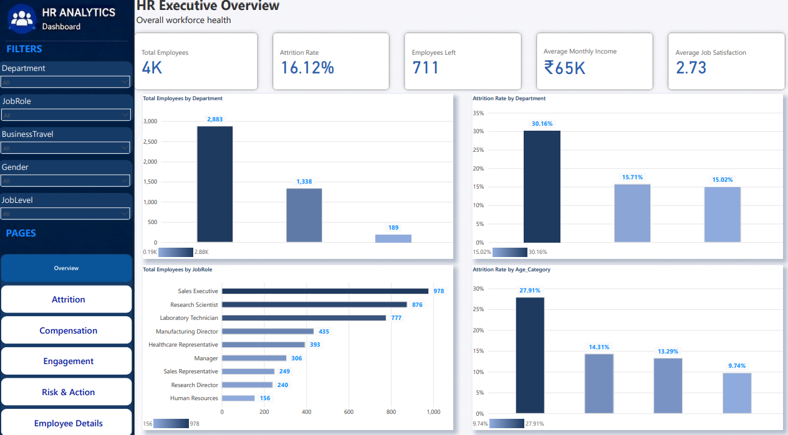
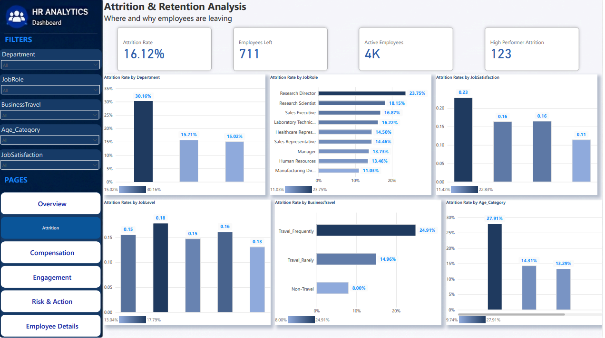
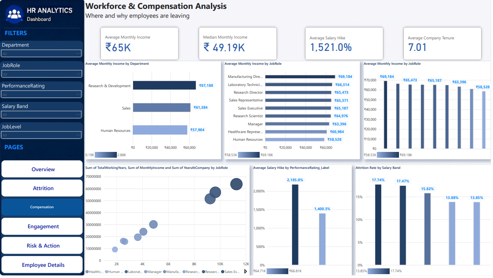
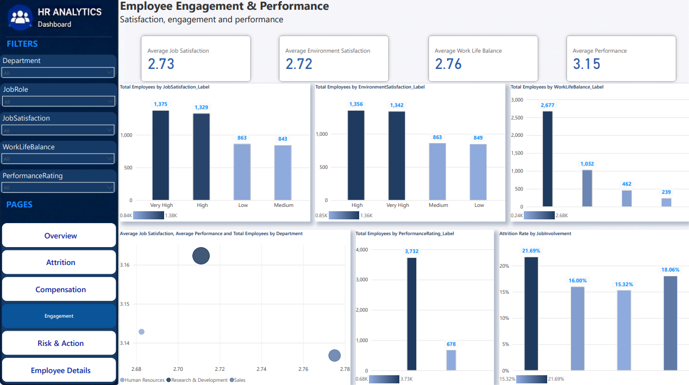
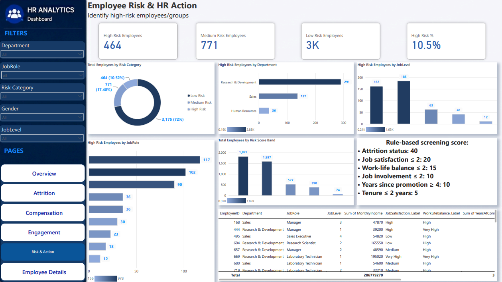
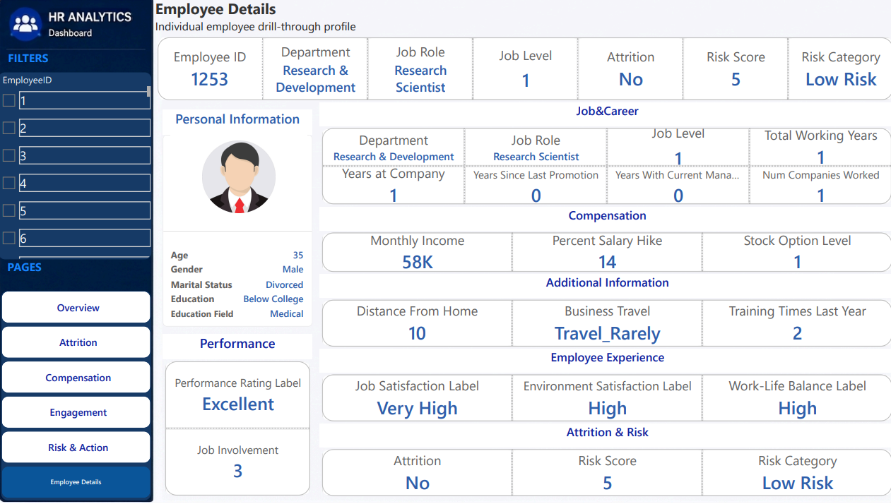

#  HR Analytics — End-to-End Data Analytics Project

> **An end-to-end HR Analytics project that transforms raw employee data into actionable workforce, attrition, compensation, performance, and employee-risk insights using Python, Excel, SQL, and Power BI.**

---

##  Project Overview

Human Resources teams need more than employee counts. They need to understand:

* Where employees are leaving
* Which employee groups have higher attrition
* How compensation relates to workforce structure
* Whether employees are satisfied and engaged
* Where promotion delays may exist
* How performance varies across departments
* Which employees may require HR attention

This project was built as an **end-to-end data analytics workflow**, starting with multiple raw HR datasets and ending with an interactive Power BI dashboard.

The project combines **Python for data preparation and EDA, Excel for data cleaning and structuring, SQL for business analysis, and Power BI for interactive reporting and decision-making.**

---

#  Business Objective

The primary objective is to analyze employee data and help HR stakeholders answer questions around:

### Workforce

* How large is the workforce?
* Which departments and job roles have the largest employee populations?
* How is the workforce distributed by gender, age, education, and experience?

### Attrition & Retention

* What is the overall employee attrition rate?
* Which departments experience the highest employee loss?
* Which job roles and employee groups have higher attrition?
* Does business travel, marital status, gender, age, or tenure relate to attrition?

### Compensation

* Which departments have the highest average salary?
* Which job roles receive the highest compensation?
* How are employees distributed across salary ranges?
* Which areas may require compensation review?

### Promotion & Career Growth

* How long do employees wait between promotions?
* Which departments have longer promotion cycles?
* Which employees may be overdue for promotion?

### Employee Experience

* Which departments have lower job satisfaction?
* Where is workplace satisfaction weaker?
* Which employees report poor work-life balance?
* Which departments show lower employee involvement?

### Performance

* How are employees distributed across performance levels?
* Which departments have stronger average performance?
* Are high-performing employees compensated differently?
* Are high-performing employees leaving the organization?

### HR Action

* Which employees show multiple potential risk indicators?
* Which departments combine attrition with weaker satisfaction?
* Which employees may deserve retention or promotion attention?

---

#  Project Workflow

```text
Raw HR Datasets
      │
      ▼
Python — Data Merging
      │
      ▼
Excel — Data Cleaning & Preparation
      │
      ▼
Python — Exploratory Data Analysis
      │
      ▼
SQL — Business Questions & Analysis
      │
      ▼
Power BI — Data Modeling, DAX & Dashboard
      │
      ▼
Business Insights & HR Recommendations
```

---

#  Repository Structure

```text
HR-Analysing-Project/
│
├── Excel/
│   └── HR_Analytics_Cleaned_data.xlsx
│
├── SQL/
│   └── Business Queries & Analysis.sql
│
├── python/
│   ├── Data Merging/
│   │   └── HR_Data_Merging.ipynb
│   │
│   └── Exploratory Data Analysis (EDA)/
│       └── HR_Analytic_EDA.ipynb
│
├── Power BI/
│   └── Interactive Dashboard.pbix
│
├── image/
│   ├── BI/
│   │   ├── dashboard_page_1.png
│   │   ├── dashboard_page_2.png
│   │   ├── dashboard_page_3.png
│   │   ├── dashboard_page_4.png
│   │   ├── dashboard_page_5.png
│   │   └── dashboard_page_6.png
│   │
│   ├── female_employee.jpg
│   └── male_employee.jpg
│
└── README.md
```

---

# 🛠️ Tools & Technologies

| Tool                     | Purpose                                           |
| ------------------------ | ------------------------------------------------- |
| 🐍 **Python**            | Data merging, validation and exploratory analysis |
| 🐼 **Pandas**            | Data manipulation and dataset merging             |
| 🔢 **NumPy**             | Numerical analysis                                |
| 📊 **Matplotlib**        | Data visualization                                |
| 📈 **Seaborn**           | Statistical visualization                         |
| 📗 **Excel**             | Data cleaning, transformation and preparation     |
| 🗄️ **SQL / PostgreSQL** | Business questions and analytical queries         |
| ⚡ **Power BI**           | Interactive dashboard and business reporting      |
| 🧮 **DAX**               | KPI calculations and analytical measures          |
| 🔗 **GitHub**            | Project version control and documentation         |

---

# 1️ Data Preparation — Python

The project begins with multiple HR datasets containing different aspects of employee information.

The Python data-merging workflow loads:

* `general_data.csv`
* `employee_survey_data.csv`
* `manager_survey_data.csv`

The datasets are connected using:

```python
EmployeeID
```

The notebook validates:

* Dataset shapes
* Column names
* Data types
* Missing values
* Duplicate records
* Unique Employee IDs
* Employee ID consistency between datasets
* Merge results

The final merge combines general employee information with employee and manager survey information.

The project then exports the merged dataset for further cleaning and analysis.

### Why Python?

Python is used here because merging several datasets programmatically is more reproducible and scalable than manually combining them.

---

# 2️ Data Cleaning — Excel

After the data-merging stage, Excel is used to prepare the analytical dataset.

The cleaned dataset contains employee-level information covering areas such as:

* Demographics
* Department
* Job role
* Education
* Compensation
* Experience
* Satisfaction
* Work-life balance
* Job involvement
* Performance
* Attrition
* Promotion history

Additional analytical labels/categories are used to make the dataset easier to analyze, including:

* Age Category
* Education Label
* Environment Satisfaction Label
* Performance Rating Label
* Experience Level

### Why Excel?

Excel provides a practical environment for:

* Inspecting the dataset
* Validating values
* Cleaning fields
* Checking consistency
* Creating business-friendly categories
* Preparing a structured dataset for downstream analysis

---

# 3️ Exploratory Data Analysis — Python

The EDA notebook performs systematic exploration of the cleaned HR dataset.

### Data Quality Checks

The analysis includes:

* Dataset shape
* Column inspection
* Data types
* Missing-value checks
* Duplicate checks
* Unique categorical values
* Descriptive statistics
* Numerical distributions
* Categorical distributions

### Statistical Exploration

The project explores variables including:

* Age
* Monthly Income
* Total Working Years
* Years at Company
* Distance From Home
* Percent Salary Hike
* Gender
* Department
* Job Role
* Education Field
* Attrition
* Satisfaction-related variables
* Performance-related variables

### Visual Analysis

The EDA uses:

* Histograms
* Box plots
* Count plots
* Distribution analysis
* Categorical comparisons

This stage helps identify patterns and potential relationships before building SQL analyses and the final dashboard.

---

# 4️ SQL — Business Questions & Analysis

SQL is used to convert HR business questions into measurable analytical queries.

The SQL analysis is organized into major business areas.

## Workforce Analysis

Examples:

* Total employee count
* Largest department
* Most common job roles
* Gender distribution
* Dominant age groups

## Attrition Analysis

Examples:

* Overall attrition rate
* Attrition by department
* Attrition by job role
* Attrition by age group
* Attrition by gender
* Attrition by marital status
* Attrition by business travel

## Salary & Compensation

Examples:

* Average salary by department
* Average salary by job role
* Highest-paid employees
* Salary-band distribution

## Promotion Analysis

Examples:

* Average years since last promotion
* Employees potentially overdue for promotion
* Promotion cycle by department

## Employee Experience

Examples:

* Job satisfaction by department
* Workplace satisfaction
* Poor work-life balance
* Job involvement by department

## Performance Analysis

Examples:

* Performance-level distribution
* Department performance
* Performance versus income
* Attrition among high performers
* Workforce experience
* Employee tenure

## Education Analysis

Examples:

* Education distribution
* Attrition by education level

## Executive Business Insights

The SQL analysis also combines multiple HR indicators to identify:

* Departments with higher attrition and lower satisfaction
* Employees with multiple potential risk indicators
* Departments with lower average income
* Employees who may be promotion candidates
* Departments balancing performance and attrition

The complete SQL analysis is available in:

`SQL/Business Queries & Analysis.sql`

---

# 5️ Power BI — Interactive HR Dashboard

Power BI is the final presentation layer of the project.

The dashboard converts the analytical results into an interactive HR decision-support tool.

The dashboard is divided into **six pages**.

---

##  Page 1 — Executive Overview

### Business Question

> **How healthy is the overall workforce?**

This page provides the high-level HR view through KPIs and workforce summaries.

Focus areas include:

* Total Employees
* Employees Left
* Active Employees
* Attrition Rate
* Average Income
* Employee Satisfaction
* Workforce distribution

### Dashboard Preview



---

##  Page 2 — Attrition & Retention

### Business Question

> **Where and among whom are employees leaving?**

This page focuses on employee attrition patterns.

Analysis includes:

* Attrition rate
* Attrition by department
* Attrition by job role
* Attrition by gender
* Attrition by age group
* Attrition by business travel
* Attrition by marital status

### Dashboard Preview



---

##  Page 3 — Workforce & Compensation

### Business Question

> **How are workforce structure and compensation related?**

This page analyzes:

* Employee demographics
* Salary distribution
* Average income
* Salary bands
* Department compensation
* Job-role compensation
* Experience and workforce structure

### Dashboard Preview



---

##  Page 4 — Engagement & Performance

### Business Question

> **Are employees engaged, satisfied and performing effectively?**

This page focuses on:

* Job satisfaction
* Environment satisfaction
* Work-life balance
* Job involvement
* Performance rating
* Department performance
* High-performing employees

### Dashboard Preview



---

##  Page 5 — Employee Risk & Action

### Business Question

> **Which employees or employee groups may require HR attention?**

This page combines HR indicators to identify potential employee risk.

The analysis considers factors such as:

* Attrition status
* Job satisfaction
* Work-life balance
* Environment satisfaction
* Job involvement
* Promotion history
* Company tenure

The objective is not to claim that an employee **will** leave.

Instead, the dashboard highlights employees or groups showing **multiple risk indicators** that HR could investigate further.

### Dashboard Preview



---

##  Page 6 — Employee Details

### Business Question

> **What do we know about an individual employee?**

This drill-through page provides employee-level information.

It allows HR users to move from an aggregated dashboard view to a specific employee profile.

The page can be used to inspect:

* Employee ID
* Department
* Job role
* Compensation
* Experience
* Satisfaction
* Performance
* Work-life balance
* Promotion history
* Risk indicators

### Dashboard Preview



---

#  Analytical Approach

The project does not rely only on simple employee counts.

It combines multiple HR dimensions to create a broader workforce view.

### Attrition Analysis

```text
Attrition Rate =
Employees Who Left / Total Employees
```

### Workforce Analysis

Employee populations are analyzed across:

* Department
* Job Role
* Gender
* Age
* Education
* Experience
* Marital Status

### Compensation Analysis

Salary is analyzed across:

* Department
* Job Role
* Salary Range
* Performance
* Experience

### Employee Risk

Potential risk is evaluated using combinations of indicators such as:

```text
Low Satisfaction
        +
Poor Work-Life Balance
        +
Low Involvement
        +
Short Tenure
        +
Promotion Delay
```

This is a **business-rule based risk framework**, not a machine-learning prediction model.

---

#  Key Business Insights

The project is designed to help HR answer questions such as:

### 1. Attrition

Identify departments, job roles and employee groups where employee turnover is comparatively higher.

### 2. Compensation

Identify departments and roles with lower average compensation that may require further investigation.

### 3. Employee Satisfaction

Identify areas where job satisfaction, workplace satisfaction or work-life balance may be weaker.

### 4. Career Growth

Identify employees with long promotion gaps who may require career-development discussions.

### 5. Performance

Compare employee performance across departments and examine whether high-performing employees have different attrition patterns.

### 6. Retention

Combine multiple employee indicators to identify groups that may benefit from targeted retention initiatives.

---

#  HR Recommendations

Based on the analytical framework, HR teams can use the dashboard to:

### Retention

* Investigate departments with comparatively high attrition.
* Focus retention programs on high-risk employee segments.
* Review early-tenure employee experience.

### Compensation

* Review compensation differences across departments and job roles.
* Compare salary with experience and performance before making adjustments.

### Career Development

* Review employees with long periods since their last promotion.
* Create clearer career-development pathways.

### Employee Experience

* Investigate groups with lower satisfaction or work-life balance.
* Improve employee engagement initiatives where indicators are weak.

### High Performer Retention

* Monitor attrition among high-performing employees.
* Combine performance, compensation, satisfaction and promotion data when evaluating retention risk.

---

# 📊 Data Quality & Scope

The final analytical dataset used in the project contains approximately **4,410 employee records and 34 analytical features**. The project includes extensive validation for missing values, duplicates, Employee IDs, data types and categorical values.

One important limitation is that the dataset does **not contain a suitable date field for employee-level time-series analysis**.

Therefore, this project does **not** claim to provide genuine monthly or yearly attrition trends.

This is important because presenting a static HR dataset as a time-series analysis would be misleading.

---

#  What This Project Demonstrates

This project demonstrates practical skills in:

* Data merging
* Data cleaning
* Data validation
* Exploratory Data Analysis
* Statistical exploration
* Business-question formulation
* SQL aggregation
* SQL filtering
* SQL `CASE` statements
* SQL `GROUP BY`
* SQL subqueries
* HR KPI development
* Business insight generation
* Power BI dashboard development
* DAX measures
* Drill-through analysis
* Data storytelling
* GitHub project documentation

---

#  Project Files

| Component            | File                                                           |
| -------------------- | -------------------------------------------------------------- |
| Data Preparation     | `python/Data Merging/HR_Data_Merging.ipynb`                    |
| Exploratory Analysis | `python/Exploratory Data Analysis (EDA)/HR_Analytic_EDA.ipynb` |
| Clean Dataset        | `Excel/HR_Analytics_Cleaned_data.xlsx`                         |
| SQL Analysis         | `SQL/Business Queries & Analysis.sql`                          |
| Power BI Dashboard   | `Power BI/Interactive Dashboard.pbix`                          |
| Dashboard Images     | `image/BI/`                                                    |


#  Project

**GitHub Repository:**
[HR-Analysing-Project](https://github.com/Sanjeetnishad/HR-Analysing-Project)

---

#  Author

**Sanjeet Nishad**

B.Sc. Information Technology | Aspiring Data Analyst / Data Scientist

---

##  Project Focus

```text
Data → Analysis → Business Questions → Insights → Decision Support
```

**The goal of this project is not simply to visualize HR data, but to turn employee data into structured business questions and actionable HR insights.**

